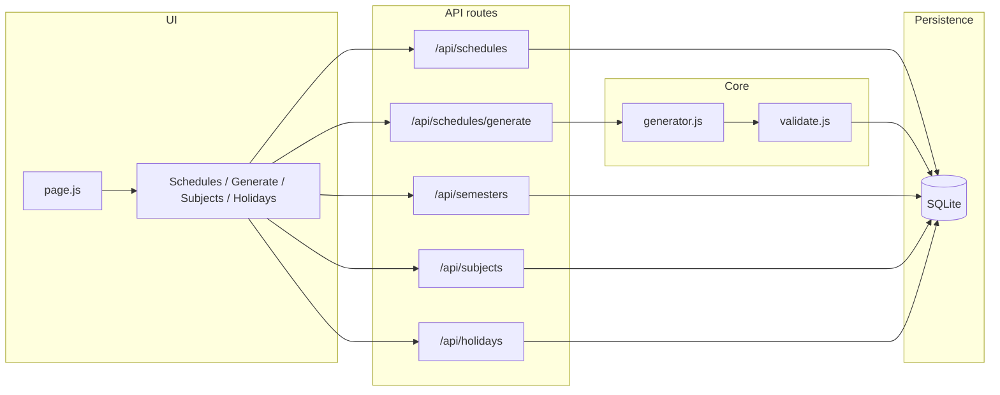
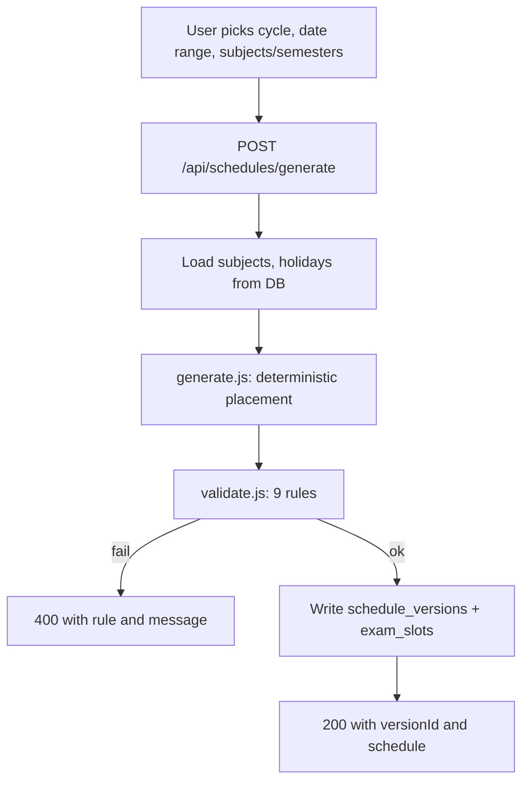

# Architecture

## Purpose

Timetable-gen is a **college examination timetable generator**. You define semesters and subjects, set holidays, choose a date range and cycle (EVEN or ODD), and the app produces a **deterministic** exam schedule with at most two slots per day (Forenoon and Afternoon), aligned with parity rules. Schedules are **versioned** (draft or published) and stored in SQLite.

## Tech stack

| Layer | Technology |
|-------|------------|
| Runtime / package manager | Bun (scripts and dev); Node for Next.js |
| Framework | Next.js 16 (App Router) |
| UI | React 19, Framer Motion, Radix UI, shadcn (new-york), Tailwind CSS 4, lucide-react, Geist fonts |
| Database | SQLite via Drizzle ORM (Bun SQLite in scripts, better-sqlite3 in Next.js) |
| Other | date-fns, react-day-picker, class-variance-authority, clsx, tailwind-merge |
| Dev | drizzle-kit, ESLint, babel-plugin-react-compiler, tw-animate-css |

## High-level flow

Generate flow in more detail:

## Folder map

| Path | Purpose |
|------|---------|
| `src/app` | Next.js App Router: root layout, main page, and API route handlers |
| `src/db` | Drizzle schema and `getDb()` (single SQLite instance) |
| `src/lib` | Domain constants, schedule generator, validator, and shared utils |
| `src/components/schedule` | Schedule/calendar views and management UI (VersionSelector, GenerateForm, SubjectsManager, HolidaysManager, etc.) |
| `src/components/ui` | Reusable UI primitives (shadcn) |
| `scripts` | DB ensure and production start (Bun); run before `next dev` / `next start` |

## Data flow (generate and publish)

1. **View schedules**: UI loads `/api/schedules` (optional `?status=published`) and `/api/semesters`; user selects a version and fetches `/api/schedules/[versionId]` to show exam slots in the calendar.
2. **Generate**: User fills Generate form (cycle, startDate, endDate, subjectIds or semesterIds, optional fixedAssignments). Frontend POSTs to `/api/schedules/generate`. Backend loads subjects and holidays, calls `generate()` then `validateSchedule()`; on success inserts one row into `schedule_versions` and multiple rows into `exam_slots`, returns `versionId` and schedule.
3. **Publish**: User triggers publish; frontend POSTs to `/api/schedules/[versionId]/publish`. Backend sets `status` to `published` (only if current status is `draft`; published versions are immutable).

All persistence is SQLite via Drizzle; there is no authentication in scope.
